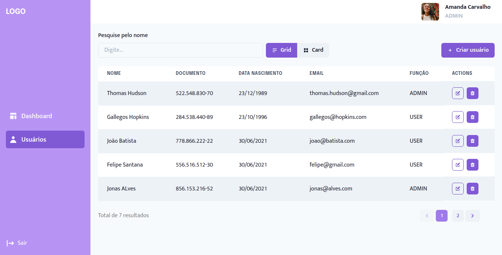

<h1>UsersSystem</h1>


---

## 💻 Sobre

O UsersSystem é um projeto de desafio passado pela Softplan. O resultado foi uma aplicação com sistema de autenticação e gerenciamento de usuários.

Neste projeto pude aprender e aprimorar demais! Consegui notar e valorizar também a importância de um código limpo, algo que tenho me atentado diariamente.
Aprendi a utilizar várias bibliotecas que nunca havia usado e/ou não tinha tamanha experiência como `react-lottie` para animações, `react-masked-text` para máscaras e o próprio `jest` para testes.
Desde já, agradeço pela oportunidade! Com certeza este desafio me fez uma profissional melhor! 😀


### Requisitos exigidos:

- [x]  A aplicação deverá estar protegida por login e senha
- [x] Deverá existir 2 tipos de perfis (ADMIN e USER)
- [x] Deverá possuir interface para pesquisa dos usuários cadastrados
- [x]  Deverá possuir interface para cadastro (CRUD) dos usuários da aplicação
- [x] Deverá possuir interface para visualizar “Meu perfil”, podendo alterar a senha
- [x] Deverá possuir a opção de “Sair” da aplicação
- [x]  Deverá aparecer o nome e/ou foto do usuário no header da aplicação

### Regras de negócio exigidas:
- [x]  O usuário com acesso ADMIN poderá executar cadastro (CRUD) de outros usuários e visualizar
- [x]  O usuário com acesso USER poderá apenas visualizar os usuários do sistema

### Requisitos não funcionais exigidos:

- [x] O frontend deverá ser desenvolvido em React;
- [x] Utilizar algum mock http, exemplo: json-server;
- [x] Utilizar algum framework UI (Material-UI, Bootstrap, AntDesign, etc…);

### PLUS:

- [x]  Testes unitários;
- [x]  Usuário possuir foto no seu cadastro;


## 🧬  Tecnologias

Utilizei as seguintes tecnologias:
- ReactJs
- NextJs
- Typescript
- Styled-components
- ChakraUI
- JSON-Server
- Jest


## Utilização do projeto

### 🔧 Baixar o projeto

Faça o clone do repositório para ter uma versão do projeto em sua máquina

```
$ git clone https://github.com/AmandaCarvalho1989/users-system.git && cd users-system
```


### 📃 Instalar dependências

Inclua no projeto as bibliotecas externas 

```
$ yarn
# ou
$ npm install
```

### 💡 Gerar uma versão funcional

Gere uma versão de build para o projeto ter uma performance melhor

```
$ yarn build
# ou
$ npm run build
```

### 🔌 Iniciar a aplicação

Inicie a aplicação em um terminal e o servidor em outro (json-server)

PS: O servidor está rodando na porta 3333, então verifique se alguma outra aplicação já está utilizando-a.

```
$ yarn start 
$ yarn server


# npm run start 
$ npm run server

```

### Usuário para testes

Email: `admin@admin.com`
Senha: `123456`


### 🎯 Funcionalidades extras:

- Tratamento de rotas inexistentes (404) e de erros internos (500)
- Paginação dos dados dos usuários
- Visualização dos dados dos usuários em tabela ou cards
- Responsividade 

### 📊 Sobre o desenvolvimento 

- Optei começar o projeto com o `NextJS` e com `Typecript`. O NextJS pelas funcionalidades que ele traz ao React, como criação de páginas dinâmicas, renderização de telas no lado do servidor, entre outras. O Typescript pela clareza que traz ao código, possibiltando melhor manutenção. 
- Escolhi utilizar o `ChakraUI`, que é uma biblioteca de componentes do React que facilita a construção da IU de um aplicativo ou site, pois ele é bem simples, flexível e acessível.
- Para o CRUD dos usuários utilizei o `Json-server` que faz a simulação de uma API.
- Para lidar com os dados dos formulários utilizei o `react-hook-form` junto com `yup`, que serve para realizar validações dos campos.
- Apesar do Chakra ter componente Toast, preferi utilizar a biblioteca `react-toastify` para mensagens de erro e/ou sucesso.
- Para alguns componentes, tive que aplicar `styled-components` para melhor funcionamento.

###  🎨 Layout

Fiz a construção das telas utilizando o Figma, você pode acessar clicando no link abaixo.
- [Layout](https://www.figma.com/file/hV3HBNcYY1RzlajZ7JaQzN/UsersSystem?node-id=0%3A1) 


